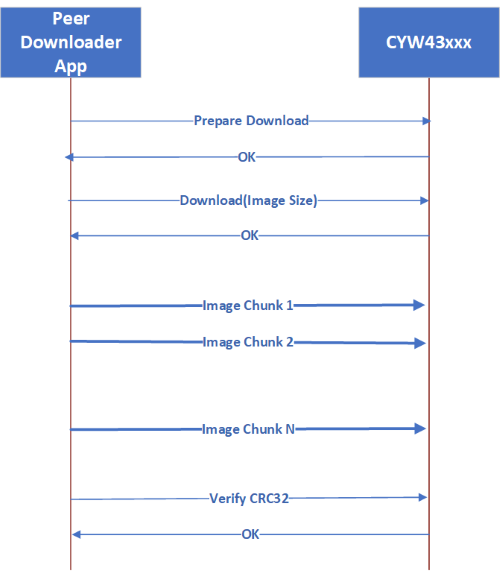

# AnyCloud: Battery Server

This code example demonstrates the implementation of a simple Bluetooth&reg; Battery Service. The Battery Service exposes the Battery Level of the device and comes with support for OTA update over Bluetooth LE. A peer app on Windows can be used to push OTA updates to the device. The app downloads and writes the image to the secondary slot. On the next reboot, MCUboot copies the new image over to the primary slot and runs the application. If the new image is not validated in runtime, on the next reboot, MCUboot reverts to the previously validated image.

MCUboot is a "secure" bootloader for 32-bit MCUs. See the [README](https://github.com/cypresssemiconductorco/mtb-example-psoc6-mcuboot-basic/blob/master/README.md) of the [mtb-example-psoc6-mcuboot-basic](https://github.com/cypresssemiconductorco/mtb-example-psoc6-mcuboot-basic) code example for more details.

The OTA feature is enabled by the *Over-the-air update middleware library*. See the [anycloud-ota](https://github.com/cypresssemiconductorco/anycloud-ota) middleware repository on Github for details.

[Provide feedback on this code example.](https://cypress.co1.qualtrics.com/jfe/form/SV_1NTns53sK2yiljn?Q_EED=eyJVbmlxdWUgRG9jIElkIjoiQ0UyMzAyOTkiLCJTcGVjIE51bWJlciI6IjAwMi0zMDI5OSIsIkRvYyBUaXRsZSI6IkFueUNsb3VkOiBCYXR0ZXJ5IFNlcnZlciIsInJpZCI6Imd2ZHUiLCJEb2MgdmVyc2lvbiI6IjMuMC4wIiwiRG9jIExhbmd1YWdlIjoiRW5nbGlzaCIsIkRvYyBEaXZpc2lvbiI6Ik1DRCIsIkRvYyBCVSI6IklDVyIsIkRvYyBGYW1pbHkiOiJQU09DIn0=)

## Requirements

- [ModusToolbox™ software](https://www.cypress.com/products/modustoolbox-software-environment) v2.3.1
- Board support package (BSP) minimum required version: 2.0.0
- Programming language: C
- Associated parts: All [PSoC&trade; 6 MCU](http://www.cypress.com/PSoC6) with [AIROC™ CYW43xxx Wi-Fi & Bluetooth® combo chips](https://www.cypress.com/products/airoc-wi-fi-combos)

## Supported toolchains (make variable 'TOOLCHAIN')

- GNU Arm&reg; Embedded Compiler v9.3.1 (`GCC_ARM`) - Default value of `TOOLCHAIN`
- IAR C/C++ compiler v8.42.2 (`IAR`)


## Supported kits (make variable 'TARGET')

- [PSoC 62S2 Wi-Fi Bluetooth pioneer kit](https://www.cypress.com/CY8CKIT-062S2-43012) (`CY8CKIT-062S2-43012`) - Default target
- [PSoC 6 Wi-Fi Bluetooth prototyping kit](https://www.cypress.com/CY8CPROTO-062-4343W) (`CY8CPROTO-062-4343W`)

## Hardware setup

This example uses the kit’s default configuration. See the respective kit guide to ensure that the kit is configured correctly.

## Software setup

To the view battery level in Battery Service, download and install the CySmart™ app for [iOS](https://itunes.apple.com/us/app/cysmart/id928939093?mt=8) or [Android](https://play.google.com/store/apps/details?id=com.cypress.cysmart&hl=en).

You can also use the [CySmart host emulation tool](http://www.cypress.com/go/cysmart) Windows PC application if you have access to the [CY5677 CySmart Bluetooth LE 4.2 USB dongle](http://www.cypress.com/documentation/development-kitsboards/cy5677-cysmart-bluetooth-low-energy-ble-42-usb-dongle).

Scan the following QR codes from your mobile phone to download the CySmart app.


Install a terminal emulator if you don't have one. Instructions in this document use [Tera Term](https://ttssh2.osdn.jp/index.html.en).

For OTA functionality a peer app is required to push the update. It can be downloaded from [OTA peer apps repo](https://github.com/cypresssemiconductorco/btsdk-peer-apps-ota). This example uses the Windows app.

**Note:** Currently, only the Windows app is supported.


## Structure and overview

This code example is a dual-core project, where the MCUboot bootloader app runs on the CM0+ core and the OTA update app runs on the CM4 core. The OTA update app fetches the new image and places it in the flash memory; the bootloader takes care of updating the existing image with the new image. The [mtb-example-psoc6-mcuboot-basic](https://github.com/cypresssemiconductorco/mtb-example-psoc6-mcuboot-basic) code example is the bootloader project used for this purpose.

The bootloader project and this OTA update project should be built and programmed independently. They must be placed separately in the workspace as you would do for any other two independent projects. An example workspace would look like this:

   ```
   <example-workspace>
      |
      |-<mtb-example-psoc6-mcuboot-basic>
      |-<mtb-example-anycloud-ble-battery-server>
      |
   ```

You must first build and program the MCUboot bootloader project into the CM0+ core; this needs to be done only once. The OTA update app can then be programmed into the CM4 core; you need to only modify this app for all application purposes.

## Building and programming MCUboot

The [mtb-example-psoc6-mcuboot-basic](https://github.com/cypresssemiconductorco/mtb-example-psoc6-mcuboot-basic) code example bundles two applications: the bootloader app that runs on CM0+, and the Blinky app that runs on CM4. For this code example, only the bootloader app is required. The root directory of the bootloader app is referred to as *\<bootloader_cm0p>* in this document.

1. Import the [mtb-example-psoc6-mcuboot-basic](https://github.com/cypresssemiconductorco/mtb-example-psoc6-mcuboot-basic) code example per the instructions in the [Using the code example](https://github.com/cypresssemiconductorco/mtb-example-psoc6-mcuboot-basic#using-the-code-example) section of its [README](https://github.com/cypresssemiconductorco/mtb-example-psoc6-mcuboot-basic/blob/master/README.md).

2. The bootloader and OTA applications must have the same understanding of the memory layout. Override the default memory layout by editing the make variables in the *\<bootloader_cm0p>/shared_config.mk* file. For this example, perform the following edits to match the memory layout with the OTA application:

   ```
   ifeq ($(USE_EXT_FLASH), 1)
   MCUBOOT_SLOT_SIZE=0x1C0000
   else
   MCUBOOT_SLOT_SIZE=0xEE000
   endif
   .
   .
   .
   MCUBOOT_SCRATCH_SIZE=0x4000
   ```

3. Copy the *\<mtb_shared>/mcuboot/\<tag>/boot/cypress/MCUBootApp/config* folder and paste it in the *\<bootloader_cm0p>* folder.

4. Edit the *\<bootloader_cm0p>/config/mcuboot_config/mcuboot_config.h* file and comment out the following defines to skip checking the image signature:

   ```
   #define MCUBOOT_SIGN_EC256
   #define NUM_ECC_BYTES (256 / 8)
   .
   .
   .
   #define MCUBOOT_VALIDATE_PRIMARY_SLOT
   ```

5. Edit *\<bootloader_cm0p>/app.mk* and replace MCUboot include `$(MCUBOOTAPP_PATH)/config` with `./config`. This gets the build system to find the new copy of the config directory that you pasted in the *\<bootloader_cm0p>* directory, instead of the default one supplied by the library.

6. Edit *\<bootloader_cm0p>/Makefile*:

   1. Set `USE_EXT_FLASH` to `1` to use the external flash to store the secondary image.

   2. Set `SWAP_UPGRADE` to `1` to enable the swap feature of MCUboot.

7. Connect the board to your PC using the provided USB cable through the KitProg3 USB connector.

8. Open a CLI terminal.

   On Linux and macOS, you can use any terminal application. On Windows, open the "modus-shell" app from the Start menu.

9. On the terminal, navigate to the *\<mtb_shared>/mcuboot/\<tag>/scripts* folder.

10. Run the following command to ensure that the required modules are installed or already present ("Requirement already satisfied:" is printed).

      ```
      pip install -r requirements.txt
      ```

11. Open a serial terminal emulator and select the KitProg3 COM port. Set the serial port parameters to 8N1 and 115200 baud.

12. Build and program the application per the [Step-by-step](https://github.com/cypresssemiconductorco/mtb-example-psoc6-mcuboot-basic#step-by-step-instructions) instructions in its [README](https://github.com/cypresssemiconductorco/mtb-example-psoc6-mcuboot-basic/blob/master/README.md).

    After programming, the bootloader application starts automatically.

    **Figure 1. Booting with no bootable image**

    

**Note:** This example does not demonstrate securely upgrading the image and booting from it using features such as image signing and "Secure Boot". See the [PSoC 64 line of "secure" MCUs](https://www.cypress.com/psoc64) that offer all those features built around MCUboot.


## Using the code example

Create the project and open it using one of the following:

<details><summary><b>In Eclipse IDE for ModusToolbox</b></summary>

### In Eclipse IDE for ModusToolbox:

1. Click the **New Application** link in the Quick Panel (or, use **File** > **New** > **ModusToolbox Application**).

2. Pick a kit supported by the code example from the list shown in the **Project Creator - Choose Board Support Package (BSP)** dialog.

   When you select a supported kit, the example is reconfigured automatically to work with the kit. To work with a different supported kit later, use the **Library Manager** to choose the BSP for the supported kit. You can use the Library Manager to select or update the BSP and firmware libraries used in this application.

   To access the Library Manager, right-click the application name from the Project Workspace window in the IDE, and select **ModusToolbox** > **Library Manager**.

   You can also just start the application creation process again and select a different kit.

   If you want to use the application for a kit not listed here, you may need to update the source files. If the kit does not have the required resources, the application may not work.

3. In the **Project Creator - Select Application** dialog, choose the example.

4. Optionally, update the **Application Name** and **Location** fields with the application name and local path where the application is created.

5. Click **Create** to complete the application creation process.

   For more details, see the Eclipse IDE for ModusToolbox User Guide: *{ModusToolbox install directory}/ide_{version}/docs/mt_ide_user_guide.pdf*.

</details>

<details><summary><b>In command-line interface (CLI)</b></summary>

1. Download and unzip this repository onto your local machine, or clone the repository.

2. Open a CLI terminal and navigate to the application folder.

   On Linux and macOS, you can use any terminal application. On Windows, open the "modus-shell" app from the Start menu.

3. Import the required libraries by executing the `make getlibs` command.

</details>

<details><summary><b>In third-party IDEs</b></summary>

1. Follow the instructions from the **In command-line interface (CLI)** section to download or clone the repository, and import the libraries using the `make getlibs` command.

2. Export the application to a supported IDE using the `make <ide>` command.

3. Follow the instructions displayed in the terminal to create or import the application as an IDE project.

For more details, see the "Exporting to IDEs" section of the ModusToolbox user guide: *{ModusToolbox install directory}/ide_{version}/docs/mtb_user_guide.pdf*.

</details>


## Operation

### Battery Service

1. Connect the board to your PC using the provided USB cable through the KitProg3 USB connector.

2. Use your favorite serial terminal application and connect to the KitProg3 COM port. Configure the terminal application to access the serial port using the following settings.

   Baud rate: 115200 bps; Data: 8 bits; Parity: None; Stop: 1 bit; Flow control: None; New line for receive data: Line Feed(LF) or Auto setting

 3. Program the board using one of the following:

    <details><summary><b>Using Eclipse IDE for ModusToolbox</b></summary>

      1. Select the application project in the Project Explorer.

      2. In the **Quick Panel**, scroll down, and click **\<Application Name> Program (KitProg3)**.


    </details>

    <details><summary><b>Using CLI</b></summary>

      From the terminal, execute the `make program` command to build and program the application using the default toolchain to the default target. You can specify a target and toolchain manually:

      ```
      make program TARGET=<BSP> TOOLCHAIN=<toolchain>
      ```

      Example:

      ```
      make program TARGET=CY8CKIT-062S2-43012 TOOLCHAIN=GCC_ARM
      ```

      **Note**:  Before building the application, ensure that the *deps* folder contains the BSP file (*TARGET_xxx.lib*) corresponding to the TARGET. Execute the `make getlibs` command to fetch the BSP contents before building the application.

     </details>

      After programming, the application starts automatically. Observe the messages on the UART terminal, and wait for the device to make all the required connections.

#### Test using the CySmart mobile app

1. Turn ON Bluetooth on your Android or iOS device.

2. Launch the CySmart app.

3. Press the reset switch on the kit to start BLE advertisements. The red LED (LED1) starts blinking to indicate that advertising has started. Advertising will stop after 120 seconds if a connection has not been established.

4. Swipe down on the CySmart app home screen to start scanning for BLE Peripherals; your device appears in the CySmart app home screen. Select your device to establish a BLE connection (see Figure 2). Once the connection is established, the user LED turns to 'always ON' state.

   **Figure 2. CySmart app device discovery**

   

5. Select Battery Service (see Figure 3) from the carousel view to check the Battery levels. Tap **Start Notify** to get notifications of the changing battery level:

   **Figure 3. CySmart app Battery Service**

   


   **Figure 4. Battery level**

   

6. Use the KitProg3 COM port to view the Bluetooth stack and application trace messages in the terminal window. Note the application version.

   **Figure 5. Log messages on KitProg3 COM port**

   


### OTA Service

The app also has support for OTA over Bluetooth LE. A peer app is used to push an update image to the device. It can be downloaded from the [OTA peer apps repo](https://github.com/cypresssemiconductorco/btsdk-peer-apps-ota). This example uses the Windows app for pushing an OTA image.

Once you have programmed the app by following steps in the [Battery Service section](#Battery-service) , you would see the app version as `3.0.0` in the terminal logs as shown in Figure 5.

For the OTA update, do the following changes to the app:

1. Change the update rate of the Battery level by modifying the define `BATTERY_LEVEL_CHANGE` to `4`. This shows that the battery drains at double the rate after the OTA update. This is also shown in the terminal logs as well as CySmart app graphic.

2. Update the app version number in the Makefile by changing the `MAJOR VERSION`, `MINOR VERSION`, and `VERSION BUILD`. In this example, update the version to 3.1.0 by modifying `MINOR VERSION` to `1`.

3. Build the app, but **DO NOT PROGRAM**. This version of the app will be used to push to the device via the peer Windows app *WsOtaUpgrade.exe*.

4. In the project directory, navigate to *build/\<TARGET>/\<Config>* and locate the *.bin* file. Copy this file to the same directory as the peer app *WsOtaUpgrade.exe*. It is located at *btsdk-peer-apps-ota/tree/master/Windows/WsOtaUpgrade/Release/\<System Type>*.

5. Open the terminal and navigate to the *WsOtaUpgrade.exe*. Initiate the update process by issuing the following command:
   ```
   ./WsOtaUpgrade.exe <App_name>.bin
   ```

6. In the dialog box that appears, select your device and click **OK** (*Battery Server* in this case). In the next Window, select **Start** to begin pushing the OTA update to the device.

   **Figure 6. WsOtaUpgrade app**

   


   **Figure 7. WsOtaUpgrade app start**

   

   You can monitor the progress on the Windows peer app via progress bar or via the device terminal, which prints the percentage of download completed.

   **Figure 8. WsOtaUpgrade progress bar**

   


   **Figure 9. Download progress display on the terminal**

   

   Once the download is completed, the device will reboot. To manually initiate the reboot, set `reboot_at_end` to `0`. On reboot, MCUboot either copies the new image over to the primary slot or swaps the images in primary and secondary slots depending upon the configuration done (See [Building and programming MCUboot](#Building-and-programming-MCUboot)) and runs the application.

   If the new image is not validated in runtime, on the next reboot, MCUboot reverts to the previously validated image. The validation is done by calling the `cy_ota_storage_validated()` API. You can turn off the validation requirement by setting `validate after reboot = 0` in `ota_agent_parameters`.

   **Note:** The revert operation will happen only if swap upgrade is enabled by setting `SWAP_UPGRADE = 1` as described in [Building and programming MCUboot](#Building-and-programming-MCUboot), and `validate after reboot = 1` in `ota_agent_parameters`. If not, the image will be validated after download by the library and marked permanent. Thus, revert will not happen because the requirement for the updated app to call `cy_ota_storage_validated()` is waived off.

   **Figure 10. MCUboot reboot on download finish**

   


7. Observe the terminal for upgrade logs. Notice the updated app version in the terminal log once the app is launched by MCUboot on a successful update.

   **Figure 11. MCUboot upgrading to the latest OTA image**

   

8. Once the upgrade is done, follow the steps mentioned in [Test using the CySmart mobile app section](#Test-using-the-CySmart-mobile-app). Notice that now the rate of change of battery level is faster (reduces by 4) both in terminal logs as well as CySmart app.

   **Figure 12. Updated app with faster rate of change of battery level**

   


### OTA revert

To test the revert feature of MCUboot, you need to send a 'bad' image as the v3.2.0 OTA update. The bad image used in this example does not call `cy_ota_storage_validated()`; instead it prints the banner and issues a soft reset. Upon reboot, MCUboot reverts the primary image back to the v3.1.0 'good' image.

1. Edit the *Makefile* and add `TEST_REVERT` to the `Defines` variable to test the revert functionality:

   ```
   DEFINES+=CY_RETARGET_IO_CONVERT_LF_TO_CRLF CY_RTOS_AWARE TEST_REVERT
   ```

2. Edit the app version in the *Makefile* by setting `APP_VERSION_MINOR` to `2`. Once the changes are done, build the app, but **DO NOT PROGRAM**.

3. Use *WsOtaUpgrade.exe* to push the OTA image to the device as done in steps **3, 4, and 5** of the [OTA Service](#ota-service) section.

4. After a reset, MCUboot will now find this new v3.2.0 image and update to it. After the update, the banner is printed on the terminal and a soft reset is issued. Upon reset, MCUboot starts reverting to the v3.1.0 'good' image.

   **Figure 13. MCUboot reverting the image**

   


## Debugging

You can debug the example to step through the code. In the IDE, use the **\<Application Name> Debug (KitProg3_MiniProg4)** configuration in the **Quick Panel**. For more details, see the "Program and debug" section in the [Eclipse IDE for ModusToolbox user guide](https://www.cypress.com/MTBEclipseIDEUserGuide).

**Note:** **(Only while debugging)** On the CM4 CPU, some code in `main()` may execute before the debugger halts at the beginning of `main()`. This means that some code executes twice - once before the debugger stops execution, and again after the debugger resets the program counter to the beginning of `main()`. See [KBA231071](https://community.cypress.com/docs/DOC-21143) to learn about this and for the workaround.


## Design and implementation

The code example has two main services:

1. A Bluetooth LE GATT Server for Battery Service

   The Battery Service is used to simulate the battery level, which changes continuously from 100 to 0 percent in steps defined by the `BATTERY_LEVEL_CHANGE` macro. It has a default value of 2 percent. On a periodic timer, the notification is sent to client.

2. OTA firmware upgrade service

   The OTA firmware upgrade service allows to update the application image remotely. A peer app on Windows/Android/iOS can be used to push an OTA update to the device. The app downloads and writes the image to the secondary slot. On the next reboot, MCUboot copies the new image over to the primary slot and runs the application. If the new image is not validated in runtime, on the next reboot, MCUboot reverts to the previously validated image.

   **Figure 14. OTA transfer sequence**

   

   **Note:** Thin lines in this diagram correspond to the messages sent using the Control Point Characteristic.
   Thick lines indicate messages sent using the Data Characteristic.

Before performing the upgrade procedure, the downloader should enable notifications and indications for the Control Point Characteristic by writing the corresponding value to the Client Characteristic Configuration descriptor. If the downloader uses a Bluetooth stack that does not allow the configuration of simultaneous notifications and indications, at least one of them must be configured.

All multi-octet values (for example, the size of the image and the CRC32) are sent using the little-endian format.

To start the upgrade, the downloader sends the `CY_OTA_UPGRADE_COMMAND_PREPARE_DOWNLOAD` command (see Table 1 and Table 2 for details of the commands and events). This indicates that a new upgrade process is being started. The data received after that command will be stored from the zero-offset position of the inactive logical memory partition. The OTA library initializes the storage and clears the secondary storage on receiving this command.

After the downloader receives the `CY_OTA_UPGRADE_STATUS_OK` message, it should send the `CY_OTA_UPGRADE_COMMAND_DOWNLOAD` command, passing four bytes specifying the memory image size to be downloaded.

If `CY_OTA_UPGRADE_STATUS_OK` is received in the reply, the downloader starts sending chunks of data.

After the final image chunk is sent, the downloader sends the `CY_OTA_UPGRADE_COMMAND_VERIFY` command passing the image checksum calculated on the host. The library verifies the stored image and sends the `CY_OTA_UPGRADE_STATUS_OK` or `CY_OTA_UPGRADE_STATUS_VERIFICATION_FAILED` message to the downloader. If verification was successful, the library marks the secondary storage as verified. If the verification was not successful, the firmware sends a `CY_OTA_UPGRADE_STATUS_VERIFICATION_FAILED` status to the downloader. Depending on whether `reboot_at_end` was set as `0` (do not automatically reboot after download) or `1` (reboot after download), the device will be rebooted. On the next reboot, MCUboot will pick up the image and perform the update.

If the download process is interrupted or if the verification fails, the embedded application continues its execution. To restart the process, the downloader will need to start from the beginning by sending `CY_OTA_UPGRADE_COMMAND_PREPARE_DOWNLOAD`.

All commands and data packets are sent from the downloader to the embedded application using the GATT Write Request procedure. All the messages to the downloader except for the final verification `CY_OTA_UPGRADE_STATUS_OK` message are sent using the GATT Notification procedure. The verification `OK` message is sent using the GATT Indication procedure. If the downloader enabled notifications and did not allow indications, the verification `CY_OTA_UPGRADE_STATUS_OK` message is sent using the GATT Notify procedure.

For a better performance, it is recommended that the downloader negotiates the largest possible MTU and sends data chunks of (MTU minus 3) octets.

**Table 1. OTA firmware upgrade commands**

|Command name                              |Value |Parameters       |
|------------------------------------------|------|-----------------|
|`WICED_OTA_UPGRADE_COMMAND_PREPARE_DOWNLOAD` |1     |None             |
|`WICED_OTA_UPGRADE_COMMAND_DOWNLOAD`        |2     |4-byte image size|
|`WICED_OTA_UPGRADE_COMMAND_VERIFY`          |3     | 4-byte CRC32    |
|`WICED_OTA_UPGRADE_COMMAND_ABORT`           |7     |None             |

<br>

**Table 2. OTA firmware upgrade events**

|Event name                                  | Value | Parameters |
|--------------------------------------------|-------|------------|
|`WICED_OTA_UPGRADE_STATUS_OK`                 |  0    |            |
|`WICED_OTA_UPGRADE_STATUS_UNSUPPORTED_COMMAND`|  1    |            |
|`WICED_OTA_UPGRADE_STATUS_ILLEGAL_STATE`      |  2    |            |
|`WICED_OTA_UPGRADE_STATUS_VERIFICATION_FAILED`|  3    |            |
|`WICED_OTA_UPGRADE_STATUS_INVALID_IMAGE`      |  4    |            |

<br>

## Resources and settings

This section explains the ModusToolbox resources and their configuration as used in this code example. Note that all the configuration explained in this section has already been done in the code example. ModusToolbox stores the configuration settings of the application in the *design.modus* file. This file is used by the graphical configurators, which generate the configuration firmware. This firmware is stored in the application’s *GeneratedSource* folder.

- **Device configurator:** The Device configurator is used to enable/configure the peripherals and the pins used in the application. See the
[Device configurator guide](https://www.cypress.com/ModusToolboxDeviceConfig).

- **Bluetooth configurator:** The Bluetooth configurator is used for generating/modifying the Bluetooth LE GATT database. See the [Bluetooth configurator guide](https://www.cypress.com/ModusToolboxBLEConfig).

## Related resources

| Application notes                                            |                                                              |
| :----------------------------------------------------------- | :----------------------------------------------------------- |
| [AN228571](https://www.cypress.com/AN228571) – Getting started with PSoC 6 MCU on ModusToolbox | Describes PSoC 6 MCU devices and how to build your first application with ModusToolbox |
| [AN221774](https://www.cypress.com/AN221774) – Getting started with PSoC 6 MCU on PSoC Creator | Describes PSoC 6 MCU devices and how to build your first application with PSoC Creator |
| [AN210781](https://www.cypress.com/AN210781) – Getting started with PSoC 6 MCU with Bluetooth Low Energy (BLE) Connectivity on PSoC Creator | Describes PSoC 6 MCU with BLE Connectivity devices and how to build your first application with PSoC Creator |
| [AN215656](https://www.cypress.com/AN215656) – PSoC 6 MCU: dual-CPU system design | Describes the dual-CPU architecture in PSoC 6 MCU, and shows how to build a simple dual-CPU design |
| **Code examples**                                            |                                                              |
| [Using ModusToolbox](https://github.com/cypresssemiconductorco/Code-Examples-for-ModusToolbox-Software) | [Using PSoC Creator](https://www.cypress.com/documentation/code-examples/psoc-6-mcu-code-examples) |
| **Device documentation**                                     |                                                              |
| [PSoC 6 MCU datasheets](https://www.cypress.com/search/all?f[0]=meta_type%3Atechnical_documents&f[1]=resource_meta_type%3A575&f[2]=field_related_products%3A114026) | [PSoC 6 technical reference manuals](https://www.cypress.com/search/all/PSoC%206%20Technical%20Reference%20Manual?f[0]=meta_type%3Atechnical_documents&f[1]=resource_meta_type%3A583) |
| **Development kits**                                         | Buy at www.cypress.com                                       |
| [CY8CKIT-062-BLE](https://www.cypress.com/CY8CKIT-062-BLE) PSoC 6 Bluetooth LE pioneer kit | [CY8CKIT-062-WiFi-BT](https://www.cypress.com/CY8CKIT-062-WiFi-BT) PSoC 6 WiFi-BT pioneer kit |
| [CY8CPROTO-063-BLE](https://www.cypress.com/CY8CPROTO-063-BLE) PSoC 6 Bluetooth LE prototyping kit | [CY8CPROTO-062-4343W](https://www.cypress.com/CY8CPROTO-062-4343W) PSoC 6 Wi-Fi Bluetooth prototyping kit |
| [CY8CKIT-062S2-43012](https://www.cypress.com/CY8CKIT-062S2-43012) PSoC 62S2 Wi-Fi BT pioneer kit | [CY8CPROTO-062S3-4343W](https://www.cypress.com/CY8CPROTO-062S3-4343W) PSoC 62S3 Wi-Fi Bluetooth prototyping kit |
| [CYW9P62S1-43438EVB-01](https://www.cypress.com/CYW9P62S1-43438EVB-01) PSoC 62S1 Wi-Fi Bluetooth pioneer kit | [CYW9P62S1-43012EVB-01](https://www.cypress.com/CYW9P62S1-43012EVB-01) PSoC 62S1 Wi-Fi Bluetooth pioneer kit |                                                              |
| **Libraries**                                                 |                                                              |
| PSoC 6 peripheral driver library (PDL) and docs  | [mtb-pdl-cat1](https://github.com/cypresssemiconductorco/mtb-pdl-cat1) on GitHub |
| Hardware abstraction layer (HAL) Library and docs    | [mtb-hal-cat1](https://github.com/cypresssemiconductorco/mtb-hal-cat1) on GitHub |
| Retarget-IO - A utility library to retarget the standard input/output (STDIO) messages to a UART port | [retarget-io](https://github.com/cypresssemiconductorco/retarget-io) on GitHub |
| freeRTOS library and docs                                    | [freeRTOS](https://github.com/cypresssemiconductorco/freertos) on GitHub |
|bluetooth-freeRTOS|Cypress WICED Bluetooth/Bluetooth LE host stack solution [bluetooth-freeRTOS](http://github.com/cypresssemiconductorco/bluetooth-freertos) on GitHub|
| **Middleware**                                               |                                                              |
| CapSense&trade; library and docs                                    | [capsense](https://github.com/cypresssemiconductorco/capsense) on GitHub |
| Links to all PSoC 6 MCU middleware                           | [psoc6-middleware](https://github.com/cypresssemiconductorco/psoc6-middleware) on GitHub |
| **Tools**                                                    |                                                              |
| [Eclipse IDE for ModusToolbox](https://www.cypress.com/modustoolbox)     | The multi-platform, Eclipse-based Integrated Development Environment (IDE) that supports application configuration and development for PSoC 6 MCU and IoT designers.             |
| [PSoC Creator](https://www.cypress.com/products/psoc-creator-integrated-design-environment-ide) | The Cypress IDE for PSoC and FM0+ MCU development.            |


## Document history

Document title: *CE230299* - *AnyCloud: Battery Server*


| Version | Description of change |
| ------- | --------------------- |
| 1.0.0   | New code example      |
| 2.0.0   | Major update to support ModusToolbox software v2.2<br> This version is not backward compatible with ModusToolbox software v2.1  |
| 3.0.0 | Added OTA support, Updated to support BTStack 3.0 |

------


-------------------------------------------------------------------------------

© Cypress Semiconductor Corporation, 2020-2021. This document is the property of Cypress Semiconductor Corporation, an Infineon Technologies company, and its affiliates ("Cypress").  This document, including any software or firmware included or referenced in this document ("Software"), is owned by Cypress under the intellectual property laws and treaties of the United States and other countries worldwide.  Cypress reserves all rights under such laws and treaties and does not, except as specifically stated in this paragraph, grant any license under its patents, copyrights, trademarks, or other intellectual property rights.  If the Software is not accompanied by a license agreement and you do not otherwise have a written agreement with Cypress governing the use of the Software, then Cypress hereby grants you a personal, non-exclusive, nontransferable license (without the right to sublicense) (1) under its copyright rights in the Software (a) for Software provided in source code form, to modify and reproduce the Software solely for use with Cypress hardware products, only internally within your organization, and (b) to distribute the Software in binary code form externally to end users (either directly or indirectly through resellers and distributors), solely for use on Cypress hardware product units, and (2) under those claims of Cypress’s patents that are infringed by the Software (as provided by Cypress, unmodified) to make, use, distribute, and import the Software solely for use with Cypress hardware products.  Any other use, reproduction, modification, translation, or compilation of the Software is prohibited.
<br>
TO THE EXTENT PERMITTED BY APPLICABLE LAW, CYPRESS MAKES NO WARRANTY OF ANY KIND, EXPRESS OR IMPLIED, WITH REGARD TO THIS DOCUMENT OR ANY SOFTWARE OR ACCOMPANYING HARDWARE, INCLUDING, BUT NOT LIMITED TO, THE IMPLIED WARRANTIES OF MERCHANTABILITY AND FITNESS FOR A PARTICULAR PURPOSE.  No computing device can be absolutely secure.  Therefore, despite security measures implemented in Cypress hardware or software products, Cypress shall have no liability arising out of any security breach, such as unauthorized access to or use of a Cypress product.  CYPRESS DOES NOT REPRESENT, WARRANT, OR GUARANTEE THAT CYPRESS PRODUCTS, OR SYSTEMS CREATED USING CYPRESS PRODUCTS, WILL BE FREE FROM CORRUPTION, ATTACK, VIRUSES, INTERFERENCE, HACKING, DATA LOSS OR THEFT, OR OTHER SECURITY INTRUSION (collectively, "Security Breach").  Cypress disclaims any liability relating to any Security Breach, and you shall and hereby do release Cypress from any claim, damage, or other liability arising from any Security Breach.  In addition, the products described in these materials may contain design defects or errors known as errata which may cause the product to deviate from published specifications.  To the extent permitted by applicable law, Cypress reserves the right to make changes to this document without further notice. Cypress does not assume any liability arising out of the application or use of any product or circuit described in this document.  Any information provided in this document, including any sample design information or programming code, is provided only for reference purposes.  It is the responsibility of the user of this document to properly design, program, and test the functionality and safety of any application made of this information and any resulting product.  "High-Risk Device" means any device or system whose failure could cause personal injury, death, or property damage.  Examples of High-Risk Devices are weapons, nuclear installations, surgical implants, and other medical devices.  "Critical Component" means any component of a High-Risk Device whose failure to perform can be reasonably expected to cause, directly or indirectly, the failure of the High-Risk Device, or to affect its safety or effectiveness.  Cypress is not liable, in whole or in part, and you shall and hereby do release Cypress from any claim, damage, or other liability arising from any use of a Cypress product as a Critical Component in a High-Risk Device.  You shall indemnify and hold Cypress, including its affiliates, and its directors, officers, employees, agents, distributors, and assigns harmless from and against all claims, costs, damages, and expenses, arising out of any claim, including claims for product liability, personal injury or death, or property damage arising from any use of a Cypress product as a Critical Component in a High-Risk Device.  Cypress products are not intended or authorized for use as a Critical Component in any High-Risk Device except to the limited extent that (i) Cypress’s published data sheet for the product explicitly states Cypress has qualified the product for use in a specific High-Risk Device, or (ii) Cypress has given you advance written authorization to use the product as a Critical Component in the specific High-Risk Device and you have signed a separate indemnification agreement.
<br>
Cypress, the Cypress logo, and combinations thereof, WICED, ModusToolBox, PSoC, CapSense, EZ-USB, F-RAM, and Traveo are trademarks or registered trademarks of Cypress or a subsidiary of Cypress in the United States or in other countries.  For a more complete list of Cypress trademarks, visit cypress.com.  Other names and brands may be claimed as property of their respective owners.
