# Bluetooth&reg; LE Battery Server with OTA update

This code example demonstrates the implementation of a simple Bluetooth&reg; Battery Service. The Battery Service exposes the battery level of the device and supports over-the-air (OTA) update over a Bluetooth&reg; Low Energy connection. A peer app on Windows can be used to push OTA updates to the device. The app downloads and writes the image to the secondary slot. On the next reboot, MCUboot copies the new image over to the primary slot and runs the application. If the new image is not validated in run time, on the next reboot, MCUboot reverts to the previously validated image.

The OTA update feature is enabled by the [anycloud-ota](https://github.com/Infineon/anycloud-ota) middleware repository on Github.

[View this README on GitHub.](https://github.com/Infineon/mtb-example-btstack-freertos-battery-server)

[Provide feedback on this code example.](https://cypress.co1.qualtrics.com/jfe/form/SV_1NTns53sK2yiljn?Q_EED=eyJVbmlxdWUgRG9jIElkIjoiQ0UyMzAyOTkiLCJTcGVjIE51bWJlciI6IjAwMi0zMDI5OSIsIkRvYyBUaXRsZSI6IkJsdWV0b290aCZyZWc7IExFIEJhdHRlcnkgU2VydmVyIHdpdGggT1RBIHVwZGF0ZSIsInJpZCI6ImFtbWwiLCJEb2MgdmVyc2lvbiI6IjUuNC4wIiwiRG9jIExhbmd1YWdlIjoiRW5nbGlzaCIsIkRvYyBEaXZpc2lvbiI6Ik1DRCIsIkRvYyBCVSI6IklDVyIsIkRvYyBGYW1pbHkiOiJCVEFCTEUifQ==)

## Requirements

- [ModusToolbox&trade; software](https://www.infineon.com/modustoolbox) v3.0 or later (tested with v3.0)
- Board Support Package (BSP) minimum required version: 4.0.0
- Programming language: C
- Associated parts: All [PSoC&trade; 6 MCU](https://www.infineon.com/psoc6) with [AIROC&trade; CYW43xxx Wi-Fi & Bluetooth® combo chips](https://www.infineon.com/cms/en/product/wireless-connectivity/airoc-wi-fi-plus-bluetooth-combos/)

## Supported toolchains (make variable 'TOOLCHAIN')

- GNU Arm&reg; Embedded Compiler v11.3.1 (`GCC_ARM`) - Default value of `TOOLCHAIN`
- Arm&reg; Compiler v6.16 (`ARM`)
- IAR C/C++ Compiler v9.30.1 (`IAR`)

## Supported kits (make variable 'TARGET')

- [PSoC&trade; 62S2 Wi-Fi Bluetooth&reg; pioneer kit](https://www.infineon.com/CY8CKIT-062S2-43012) (`CY8CKIT-062S2-43012`) - Default value of `TARGET`
- [PSoC&trade; 6 Wi-Fi Bluetooth&reg; prototyping kit](https://www.infineon.com/CY8CPROTO-062-4343W) (`CY8CPROTO-062-4343W`)
- [PSoC&trade; 62S2 evaluation kit](https://www.infineon.com/CY8CEVAL-062S2) (`CY8CEVAL-062S2-LAI-4373M2`)
- [PSoC&trade; 62S2 evaluation kit](https://www.infineon.com/CY8CEVAL-062S2) ( `CY8CEVAL-062S2-MUR-43439M2`)
- [PSoC&trade; 62S2 evaluation kit](https://www.infineon.com/CY8CEVAL-062S2) ( `CY8CEVAL-062S2-CYW43022CUB`)
- [PSoC&trade; 62S3 Wi-Fi Bluetooth&reg; prototyping kit](https://www.infineon.com/cms/en/product/evaluation-boards/cy8cproto-062s3-4343w) (`CY8CPROTO-062S3-4343W`)
- [PSoC&trade; 6 Bluetooth&reg; LE pioneer kit](https://www.infineon.com/CY8CKIT-062-BLE) (`CY8CKIT-062-BLE`)
- [PSoC&trade; 6 Bluetooth&reg; LE prototyping kit](https://www.infineon.com/CY8CPROTO-063-BLE) (`CY8CPROTO-063-BLE`)
- [EZ-BLE Arduino evaluation board](https://www.infineon.com/cms/en/product/evaluation-boards/cyble-416045-eval/) (`CYBLE-416045-EVAL`)
-[AIROC&trade; CYW43022 Wi-Fi & Bluetooth&reg; combo chip](https://www.infineon.com/cms/en/product/wireless-connectivity/airoc-wi-fi-plus-bluetooth-combos/wi-fi-5-802.11ac/cyw43022)

**Note:** To use the Battery Server without the OTA update feature on the kits, set `OTA_SUPPORT = 0` in the Makefile. For the instructions related to non-OTA update-enabled Battery Server, see the non-OTA Battery Server [README.md](./non_ota_source/README.md). 

## Hardware setup

This example uses the kit’s default configuration. See the respective kit guide to ensure that the kit is configured correctly.

**Note:** The PSoC&trade; 6 Bluetooth&reg; LE pioneer kit (CY8CKIT-062-BLE) and the PSoC&trade; 6 Wi-Fi Bluetooth&reg; pioneer kit (CY8CKIT-062-WIFI-BT) ship with KitProg2 installed. The ModusToolbox&trade; software requires KitProg3. Before using this code example, make sure that the board is upgraded to KitProg3. The tool and instructions are available in the [Firmware Loader](https://github.com/Infineon/Firmware-loader) GitHub repository. If you do not upgrade, you will see an error like "unable to find CMSIS-DAP device" or "KitProg firmware is out of date".


## Software setup

1. To view the battery level in Battery Service, scan the following QR code from your Android or iOS mobile device to download the AIROC&trade; Bluetooth&reg; Connect App.

   


2. Install a terminal emulator if you don't have one. Instructions in this document use [Tera Term](https://teratermproject.github.io/index-en.html).

3. Download and install [CYPRESS&trade; Programmer](https://softwaretools.infineon.com/tools/com.ifx.tb.tool.cypressprogrammer) which will be used to program the MCUboot bootloader.

4. For OTA update functionality, download and install a peer app from the [OTA peer apps repo](https://github.com/Infineon/btsdk-peer-apps-ota). This example uses the Windows app (*WsOtaUpgrade.exe*).

**Note:** Currently, only the Windows app is supported.


## Structure and overview

This code example is a dual-core project, where the MCUboot bootloader app runs on the CM0+ core and the OTA update app runs on the CM4 core. The OTA update app fetches the new image and places it in the flash memory; the bootloader takes care of updating the existing image with the new image. [MCUboot](https://github.com/mcu-tools/mcuboot/tree/v1.8.3-cypress) v1.8.3 contains the bootloader project used as a bootloader for this code example.

If you are not familiar with MCUboot, see the [mtb-example-psoc6-mcuboot-basic](https://github.com/Infineon/mtb-example-psoc6-mcuboot-basic) code example.

You must first build and program the MCUboot bootloader project into the CM0+ core; this needs to be done only once. The OTA update app can then be programmed into the CM4 core; you need to only modify this app for any application purposes.


## Building and programming MCUboot

The [MCUboot](https://github.com/mcu-tools/mcuboot/tree/v1.8.3-cypress) v1.8.3 example bundles two applications:
- Bootloader app that runs on CM0+
- Blinky app that runs on CM4.

For this code example, the bootloader application will be programmed because only the bootloader app is required.

Do the following to build and program the MCUboot bootloader:

1. Clone the [MCUboot](https://github.com/mcu-tools/mcuboot/tree/v1.8.3-cypress) repo and switch to the `v1.8.3-cypress` branch.

   ```
   git clone https://github.com/mcu-tools/mcuboot.git

   git checkout v1.8.3-cypress
   ```
2. The bootloader and the "mtb-example-btstack-freertos-battery-server" applications must have the same understanding of the memory layout. The information is contained inside flashmaps, which both applications must use. Check the "mtb-example-btstack-freertos-battery-server" Makefile for the `OTA_FLASH_MAP` variable to find out the flashmap being used by your application.

   You need to copy this flashmap present in *<mtb_shared>/ota-update/release-vX.X.X/configs/flashmap* to the *mcuboot\boot\cypress\* folder. To learn more about flashmaps, see [OTA_FLASH_LAYOUT_README.md](https://github.com/Infineon/ota-update/blob/master/OTA_FLASH_LAYOUT_README.md) in the [ota-update](https://github.com/Infineon/ota-update) middleware repo.

   To learn more about the defines in the Makefile (especially `OTA_PLATFORM` and `OTA_FLASH_MAP`) used by the *ota-update* library and the application, see [OTA-specific Makefile defines](https://github.com/Infineon/ota-update/blob/master/OTA_MAKEFILE_INFO_README.md#3-ota-specific-makefile-defines).

   To use a different flashmap, see the "Target and flashmap use" section in the ota-update [README.md](https://github.com/Infineon/ota-update/blob/master/README.md) and determine a compatible flashmap for your kit.

3. Open a CLI terminal.

   On Linux and macOS, you can use any terminal application. On Windows, open the "modus-shell" app from the Start menu.

4. On the terminal, navigate to the */mcuboot/boot/cypress* folder.

5. Update the submodules by running the following command:

   ```
   git submodule update --init --recursive
   ```

6. Connect the board to your PC using the provided USB cable through the KitProg3 USB connector.

7. In the */mcuboot/boot/cypress* folder, execute the following command to build the application using the default toolchain and the default target (`CY8CKIT-062S2-43012`). The default toolchain and target are specified in the *toolchains.mk* file present in */mcuboot/boot/cypress*.

   ```
   make clean app APP_NAME=MCUBootApp PLATFORM=PSOC_062_2M FLASH_MAP=./psoc62_2m_int_swap_single.json`
   ```
   Make sure that `PLATFORM` and `FLASH_MAP` variables are mapped correctly while building for other kits. These variables are present in the  battery server application Makefile; use the applicable values for the target device that you are building for. For CY8CPROTO-062S3-4343W, an additional parameter (`USE_CUSTOM_DEBUG_UART`) must be provided; see this [link](https://github.com/Infineon/ota-update/blob/master/configs/flashmap/MCUBoot_Build_Commands.md#2-psoc-62-512k-internal-flash-platforms) for an example.

8. After building the MCUboot application, open the HEX file using [CYPRESS&trade; Programmer](https://softwaretools.infineon.com/tools/com.ifx.tb.tool.cypressprogrammer) located in the following root directory:

   */mcuboot/boot/cypress/MCUBootApp/out/<OTA_PLATFORM>/Debug/*

      **Figure 1. CYPRESS&trade; Programmer with HEX file image**

      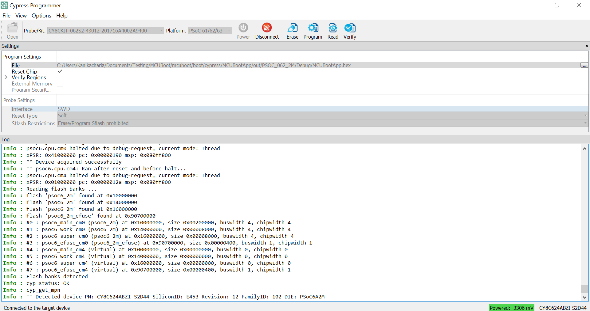

9. After programming, the bootloader starts automatically. Confirm that the UART terminal displays a message as follows:

    **Figure 2. Booting with no bootable image**

    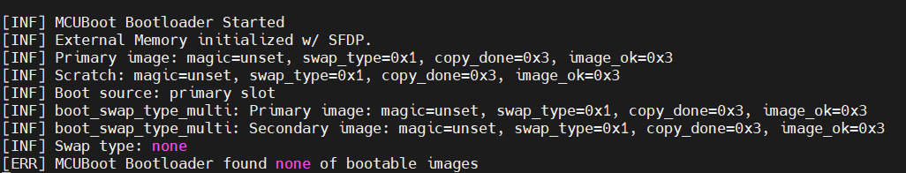

**Note:** This example implements only the basic security measure via image signing and validation; it does not demonstrate securely upgrading an image and booting from it using features such as image encryption and "Secure Boot". See the [PSoC&trade; 64 line of "secure" MCUs](https://www.infineon.com/cms/en/product/microcontroller/32-bit-psoc-arm-cortex-microcontroller/psoc-6-32-bit-arm-cortex-m4-mcu/psoc-64/) that offer all those features built around MCUboot.

## Using the code example

Make sure that the MCUboot bootloader is programmed before following the steps in this section. See the [Building and programming MCUboot](#building-and-programming-mcuboot) section for details.

### Create the project

The ModusToolbox&trade; tools package provides the Project Creator as both a GUI tool and a command line tool.

<details><summary><b>Use Project Creator GUI</b></summary>

1. Open the Project Creator GUI tool.

   There are several ways to do this, including launching it from the dashboard or from inside the Eclipse IDE. For more details, see the [Project Creator user guide](https://www.infineon.com/ModusToolboxProjectCreator) (locally available at *{ModusToolbox&trade; install directory}/tools_{version}/project-creator/docs/project-creator.pdf*).

2. On the **Choose Board Support Package (BSP)** page, select a kit supported by this code example. See [Supported kits](#supported-kits-make-variable-target).

   > **Note:** To use this code example for a kit not listed here, you may need to update the source files. If the kit does not have the required resources, the application may not work.

3. On the **Select Application** page:

   a. Select the **Applications(s) Root Path** and the **Target IDE**.

   > **Note:** Depending on how you open the Project Creator tool, these fields may be pre-selected for you.

   b.	Select this code example from the list by enabling its check box.

   > **Note:** You can narrow the list of displayed examples by typing in the filter box.

   c. (Optional) Change the suggested **New Application Name** and **New BSP Name**.

   d. Click **Create** to complete the application creation process.

</details>

<details><summary><b>Use Project Creator CLI</b></summary>

The 'project-creator-cli' tool can be used to create applications from a CLI terminal or from within batch files or shell scripts. This tool is available in the *{ModusToolbox&trade; install directory}/tools_{version}/project-creator/* directory.

Use a CLI terminal to invoke the 'project-creator-cli' tool. On Windows, use the command-line 'modus-shell' program provided in the ModusToolbox&trade; installation instead of a standard Windows command-line application. This shell provides access to all ModusToolbox&trade; tools. You can access it by typing "modus-shell" in the search box in the Windows menu. In Linux and macOS, you can use any terminal application.

The following example clones the "mtb-example-btstack-freertos-battery-server" application with the desired name "BatteryServer" configured for the CY8CPROTO-062-4343W BSP into the specified working directory, C:/mtb_projects:
   ```
  project-creator-cli --board-id CY8CPROTO-062-4343W --app-id mtb-example-btstack-freertos-battery-server --user-app-name BatteryServer --target-dir "C:/mtb_projects"
   ```

The 'project-creator-cli' tool has the following arguments:

Argument | Description | Required/optional
---------|-------------|-----------
`--board-id` | Defined in the <id> field of the [BSP](https://github.com/Infineon?q=bsp-manifest&type=&language=&sort=) manifest | Required
`--app-id`   | Defined in the <id> field of the [CE](https://github.com/Infineon?q=ce-manifest&type=&language=&sort=) manifest | Required
`--target-dir`| Specify the directory in which the application is to be created if you prefer not to use the default current working directory | Optional
`--user-app-name`| Specify the name of the application if you prefer to have a name other than the example's default name | Optional

> **Note:** The project-creator-cli tool uses the `git clone` and `make getlibs` commands to fetch the repository and import the required libraries. For details, see the "Project creator tools" section of the [ModusToolbox&trade; tools package user guide](https://www.infineon.com/ModusToolboxUserGuide) (locally available at {ModusToolbox&trade; install directory}/docs_{version}/mtb_user_guide.pdf).

</details>


### Open the project

After the project has been created, you can open it in your preferred development environment.


<details><summary><b>Eclipse IDE</b></summary>

If you opened the Project Creator tool from the included Eclipse IDE, the project will open in Eclipse automatically.

For more details, see the [Eclipse IDE for ModusToolbox&trade; user guide](https://www.infineon.com/MTBEclipseIDEUserGuide) (locally available at *{ModusToolbox&trade; install directory}/docs_{version}/mt_ide_user_guide.pdf*).

</details>


<details><summary><b>Visual Studio (VS) Code</b></summary>

Launch VS Code manually, and then open the generated *{project-name}.code-workspace* file located in the project directory.

For more details, see the [Visual Studio Code for ModusToolbox&trade; user guide](https://www.infineon.com/MTBVSCodeUserGuide) (locally available at *{ModusToolbox&trade; install directory}/docs_{version}/mt_vscode_user_guide.pdf*).

</details>


<details><summary><b>Keil µVision</b></summary>

Double-click the generated *{project-name}.cprj* file to launch the Keil µVision IDE.

For more details, see the [Keil µVision for ModusToolbox&trade; user guide](https://www.infineon.com/MTBuVisionUserGuide) (locally available at *{ModusToolbox&trade; install directory}/docs_{version}/mt_uvision_user_guide.pdf*).

</details>


<details><summary><b>IAR Embedded Workbench</b></summary>

Open IAR Embedded Workbench manually, and create a new project. Then select the generated *{project-name}.ipcf* file located in the project directory.

For more details, see the [IAR Embedded Workbench for ModusToolbox&trade; user guide](https://www.infineon.com/MTBIARUserGuide) (locally available at *{ModusToolbox&trade; install directory}/docs_{version}/mt_iar_user_guide.pdf*).

</details>

<details><summary><b>Command line</b></summary>

If you prefer to use the CLI, open the appropriate terminal, and navigate to the project directory. On Windows, use the command-line 'modus-shell' program; on Linux and macOS, you can use any terminal application. From there, you can run various `make` commands.

For more details, see the [ModusToolbox&trade; tools package user guide](https://www.infineon.com/ModusToolboxUserGuide) (locally available at *{ModusToolbox&trade; install directory}/docs_{version}/mtb_user_guide.pdf*).

</details>

## Operation

### Battery Service

1. Connect the board to your PC using the provided USB cable through the KitProg3 USB connector.

2. Use your favorite serial terminal application and connect to the KitProg3 COM port. Configure the terminal application to access the serial port using the following settings:

   Baud rate: 115200 bps; Data: 8 bits; Parity: None; Stop: 1 bit; Flow control: None; New line for receive data: Line Feed(LF) or Auto setting

 3. Program the board using one of the following:

    <details><summary><b>Using Eclipse IDE for ModusToolbox&trade; software</b></summary>

      1. Select the application project in the Project Explorer.

      2. In the **Quick Panel**, scroll down, and click **\<Application Name> Program (KitProg3)**.
    </details>

    <details><summary><b>Using CLI</b></summary>

      From the terminal, execute the `make program` command to build and program the application using the default toolchain to the default target. The default toolchain is specified in the application's Makefile but you can override this value manually:

      ```
      make program TOOLCHAIN=<toolchain>
      ```

      Example:

      ```
      make program TOOLCHAIN=GCC_ARM
      ```

      **Note:**  Before building the application, ensure that the *bsps* folder contains the BSP files in the *TARGET_APP_xxx* folder. If the files are missing, use the Library Manager to add these files. You can invoke the Library Manager from the terminal using the `make library-manager` command or use the Library Manager CLI tool "library-manager-cli" to add/change the BSP.

     </details>

      After programming, the application starts automatically. Observe the messages on the UART terminal, and wait for the device to make all the required connections.

#### **Test using the AIROC&trade; Bluetooth&reg; Connect mobile app**

1. Turn ON Bluetooth&reg; on your Android or iOS device.

2. Launch the AIROC&trade; Bluetooth&reg; Connect app.

3. Press the reset switch on the kit to start Bluetooth&reg; LE advertisements. The red LED (LED1) starts blinking to indicate that advertising has started. Advertising will stop after 120 seconds if a connection has not been established.

4. Swipe down on the AIROC&trade; Bluetooth&reg; Connect app home screen to start scanning for Bluetooth&reg; LE peripherals; your device appears on the AIROC&trade; Bluetooth&reg; Connect app home screen. Select your device to establish a Bluetooth&reg; LE connection (see Figure 2). Once the connection is established, the user LED turns to 'always ON' state.

   **Figure 3. AIROC&trade; Bluetooth&reg; Connect app device discovery**

   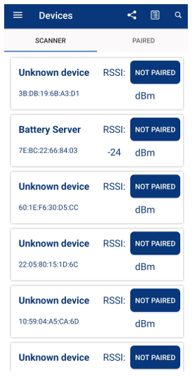

5. Select the Battery Service (see Figure 4) from the carousel view to check the battery levels. Tap **START NOTIFY** to get notifications of the changing battery levels:

   **Figure 4. AIROC&trade; Bluetooth&reg; Connect Battery Service tab**

   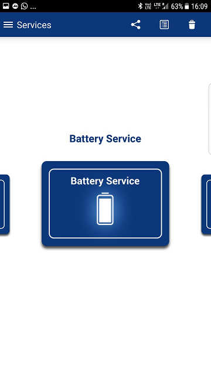


   **Figure 5. Battery level**

   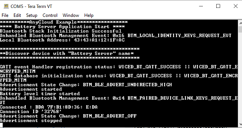

6. A notification is issued every 1 second, and the value is reduced by 2.

7. Use the KitProg3 COM port to view the Bluetooth&reg; stack and application trace messages in the terminal window. Note the application version. This app version is as per the app version numbers defined in the Makefile `MAJOR VERSION`, `MINOR VERSION`, and `VERSION BUILD`.

   **Figure 6. Log messages on KitProg3 COM port**

   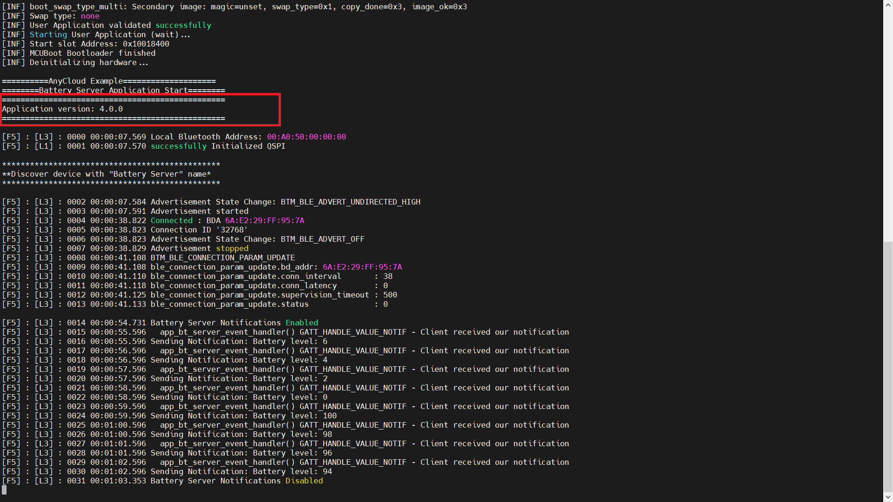


### OTA Update service

The app also supports OTA updates over Bluetooth&reg; LE. A peer app is used to push an updated image to the device. It can be downloaded from the [OTA peer apps repo](https://github.com/Infineon/btsdk-peer-apps-ota). This example uses the Windows app for pushing an OTA update image.

Once you have programmed the app by following the steps in the [Battery Service](#battery-service) section, you will see the app version as `5.0.0` in the terminal logs as shown in Figure .

For preparing the OTA update image, do the following changes to the app:

1. Change the update rate of the battery level by modifying the `BATTERY_LEVEL_CHANGE` define present in *main.c* to `4`. This shows that the battery drains at double the rate after the OTA update. This is also shown in the terminal logs as well as on the AIROC&trade; Bluetooth&reg; Connect app.

2. Update the app version number in the Makefile by changing the `MAJOR VERSION`, `MINOR VERSION`, and `VERSION BUILD`. In this example, update the version to 5.1.0 by modifying `MINOR VERSION` to `1`.

3. Build the app, but **DO NOT PROGRAM**. This version of the app will be used to push to the device via the peer Windows app (*WsOtaUpgrade.exe*).

4. In the project directory, navigate to *build/\<TARGET>/Config* and locate the *.bin* file. Copy this file to the same directory as the peer app (*WsOtaUpgrade.exe*). It is located at *btsdk-peer-apps-ota/tree/master/Windows/WsOtaUpgrade/Release/\<System Type>*.

5. Open the terminal and navigate to *WsOtaUpgrade.exe*. Initiate the update process by issuing the following command:
   ```
   ./WsOtaUpgrade.exe <App_name>.bin
   ```

6. In the dialog box that appears, select your device and click **OK** (*Battery Server* in this case). In the next window, select **Start** to begin pushing the OTA update image to the device.

   **Figure 7. WsOtaUpgrade app**

   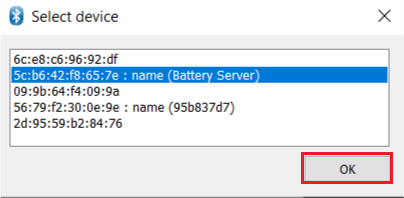


   **Figure 8. WsOtaUpgrade app start**

   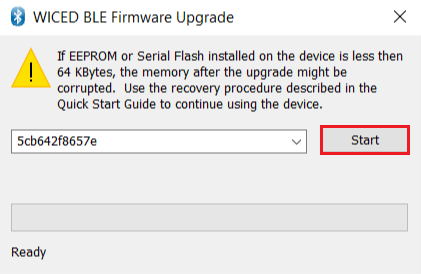

   You can monitor the progress on the Windows peer app via the progress bar or via the device terminal, which prints the percentage of download completed.

   **Figure 9. WsOtaUpgrade progress bar**

   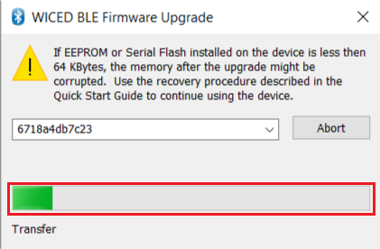


   **Figure 10. Download progress display on the terminal**

   

   Once the download is completed, the device will reboot. To manually initiate the reboot, set `reboot_at_end` to `0` in the `app_bt_initialize_default_values()` function. On reboot, MCUboot either copies the new image over to the primary slot or swaps the images in the primary and secondary slots based upon whether the overwrite- or swap-based flashmap is used, and then launches the application.

   If the new image is not validated in run time, on the next reboot, MCUboot reverts to the previously validated image. The validation is done by calling the `cy_ota_storage_validated()` API. You can turn off the validation requirement by setting `validate after reboot = 0` in the `cy_ota_agent_params_t` structure passed to the `cy_ota_agent_start` API in the *ota.c* file in the  `app_bt_ota_init` function.

   **Note:** The revert operation will happen only if swap-based flashmap is used and `validate after reboot = 1` is set in `ota_agent_parameters`. If not, the image will be validated after download by the library and marked permanent. Thus, revert will not happen because the requirement for the updated app to call `cy_ota_storage_validated()` is waived off.

   **Figure 11. MCUboot reboot on download finish**

   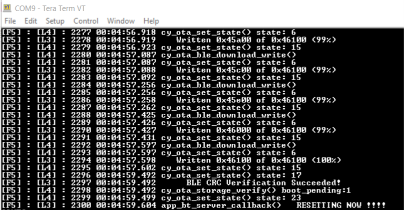


7. Observe the terminal for upgrade logs. Notice the updated app version in the terminal log once the app is launched by MCUboot on a successful update.

8. Once the upgrade is done, follow the steps mentioned in the [Test using the AIROC&trade; Bluetooth&reg; Connect mobile app](#test-using-the-AIROC&trade;-Bluetooth&reg;-Connect-mobile-app) section. Notice that now the rate of change of battery level is faster (reduces by 4) both in the terminal logs as well as the AIROC&trade; Bluetooth&reg; Connect app.

   **Figure 12. Updated app with faster rate of change of battery level**

   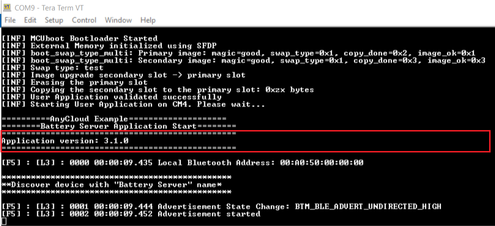


### OTA update image revert

To test the revert feature of MCUboot, you need to create and send a 'bad' image (v5.2.0) as an OTA update. The bad image used in this example does not call `cy_ota_storage_validated()`; instead it prints a banner message and issues a soft reset. Upon reboot, MCUboot reverts the primary image back to the v5.1.0 'good' image.

1. Edit the Makefile and add `TEST_REVERT` to the `Defines` variable to test the revert functionality:

   ```
   DEFINES+=CY_RETARGET_IO_CONVERT_LF_TO_CRLF CY_RTOS_AWARE TEST_REVERT
   ```

2. Edit the app version in the Makefile by setting `APP_VERSION_MINOR` to `2`. Once the changes are done, build the app, but **DO NOT PROGRAM**.

3. Use *WsOtaUpgrade.exe* to push the OTA update image to the device as done in steps **3, 4, and 5** of the [OTA Update Service](#ota-update-service) section.

4. After a reset, MCUboot will now find this new v4.2.0 image and update to it. After the update, a banner text is printed on the terminal and a soft reset is issued. Upon reset, MCUboot starts reverting to the v4.1.0 'good' image.

   **Figure 13. MCUboot reverting the image**

   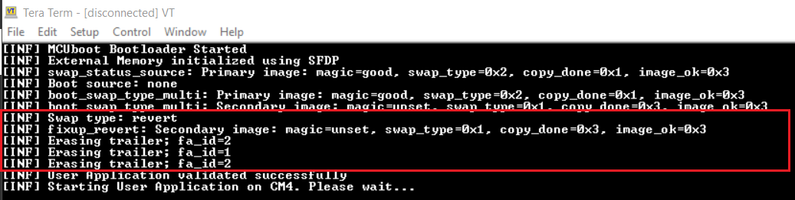


## Debugging

You can debug the example to step through the code. In the IDE, use the **\<Application Name> Debug (KitProg3_MiniProg4)** configuration in the **Quick Panel**. For more details, see the "Program and debug" section in the [Eclipse IDE for ModusToolbox&trade; software user guide](https://www.infineon.com/MTBEclipseIDEUserGuide).

**Note:** **(Only while debugging)** On the CM4 CPU, some code in `main()` may execute before the debugger halts at the beginning of `main()`. This means that some code executes twice - once before the debugger stops execution, and again after the debugger resets the program counter to the beginning of `main()`. See [KBA231071](https://community.infineon.com/t5/Knowledge-Base-Articles/PSoC-6-MCU-Code-in-main-executes-before-the-debugger-halts-at-the-first-line-of/ta-p/253856) to learn about this and for the workaround.


## Design and implementation

The code example has two main services:

1. A Bluetooth&reg; LE GATT Server for Battery Service

   Battery Service is used to simulate the battery level, which changes continuously from 100 to 0 percent in steps defined by the `BATTERY_LEVEL_CHANGE` macro. It has a default value of 2 percent. On a periodic timer, notifications are sent to the client.

2. OTA Firmware Upgrade Service

   The OTA Firmware Upgrade Service enables updating the application image remotely. A peer app on Windows/Android/iOS (currently, only Windows peer app is supported) can be used to push an OTA update to the device.

   The app downloads and writes the image to the secondary slot. On the next reboot, MCUboot copies the new image over to the primary slot and runs the application. If the new image is not validated in run time, on the next reboot, MCUboot reverts to the previously validated image.

   **Figure 14. OTA image transfer sequence**

   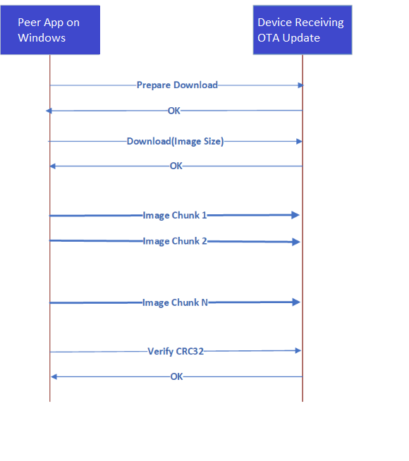

   **Note:** Thin lines in this diagram correspond to the messages sent using the Control Point characteristic. Thick lines indicate messages sent using the Data characteristic.

Before performing the upgrade procedure, the peer app on the host should enable notifications and indications for the Control Point characteristic by writing the corresponding value to the Client Characteristic Configuration descriptor. If the peer app on the host uses a Bluetooth&reg; stack that does not allow the configuration of simultaneous notifications and indications, at least one of them must be configured.

All multi-octet values (for example, the size of the image and CRC32 checksum) are sent in little-endian format.

1. To start the upgrade, the peer app on the host sends the `CY_OTA_UPGRADE_COMMAND_PREPARE_DOWNLOAD` command (see tables 1 and 2 for details of the commands and events).

   This indicates that a new upgrade process is being started. The data received after that command is stored from the zero-offset position of the inactive logical memory partition. The OTA update library initializes the storage and clears the secondary storage on receiving this command.

2. After the peer app on the host receives the `CY_OTA_UPGRADE_STATUS_OK` message, it should send the `CY_OTA_UPGRADE_COMMAND_DOWNLOAD` command, passing four bytes specifying the memory image size to be downloaded.

3. If `CY_OTA_UPGRADE_STATUS_OK` is received in the reply, the peer app on the host starts sending chunks of data.

4. After the final image chunk is sent, the peer app on the host sends the `CY_OTA_UPGRADE_COMMAND_VERIFY` command passing the image checksum calculated on the host. The library verifies the stored image and sends the `CY_OTA_UPGRADE_STATUS_OK` or `CY_OTA_UPGRADE_STATUS_VERIFICATION_FAILED` message to the peer app on the host.

   - If verification is successful, the library marks the secondary storage as verified.
   - If the verification is not successful, the firmware sends a `CY_OTA_UPGRADE_STATUS_VERIFICATION_FAILED` status to the peer app on the host.

      Depending on whether `reboot_at_end` was set as `0` (do not automatically reboot after download) or `1` (reboot after download), the device will be rebooted. On the next reboot, MCUboot will pick up the image and perform the update.

   - If the download process is interrupted or if the verification fails, the embedded application continues its execution. To restart the process, the peer app on the host will need to start from the beginning by sending `CY_OTA_UPGRADE_COMMAND_PREPARE_DOWNLOAD`.

The following GATT procedures are used in the communication:

- All commands and data packets are sent from the peer app on the host to the embedded application using the GATT Write Request procedure.

- All the messages to the peer app on the host except for the final verification message (`CY_OTA_UPGRADE_STATUS_OK`) are sent using the GATT Notification procedure.

- The verification `OK` message is sent using the GATT Indication procedure.

- If the peer app on the host enabled notifications and did not allow indications, the verification message (`CY_OTA_UPGRADE_STATUS_OK`) is sent using the GATT Notify procedure.

For a better performance, it is recommended that the peer app on the host negotiates the largest possible MTU and sends data chunks of (MTU minus 3) octets.

**Table 1. OTA firmware upgrade commands**

|Command name                              |Value |Parameters       |
|------------------------------------------|------|-----------------|
|`WICED_OTA_UPGRADE_COMMAND_PREPARE_DOWNLOAD` |1     |None             |
|`WICED_OTA_UPGRADE_COMMAND_DOWNLOAD`        |2     |4-byte image size|
|`WICED_OTA_UPGRADE_COMMAND_VERIFY`          |3     |4-byte CRC32    |
|`WICED_OTA_UPGRADE_COMMAND_ABORT`           |7     |None             |

<br>

**Table 2. OTA firmware upgrade events**

|Event name                                  | Value | Parameters |
|--------------------------------------------|-------|------------|
|`WICED_OTA_UPGRADE_STATUS_OK`                 |  0    |            |
|`WICED_OTA_UPGRADE_STATUS_UNSUPPORTED_COMMAND`|  1    |            |
|`WICED_OTA_UPGRADE_STATUS_ILLEGAL_STATE`      |  2    |            |
|`WICED_OTA_UPGRADE_STATUS_VERIFICATION_FAILED`|  3    |            |
|`WICED_OTA_UPGRADE_STATUS_INVALID_IMAGE`      |  4    |            |

<br>

###	Secure OTA image update

This code example uses the private key to sign the OTA update image that is downloaded to the device during the OTA update. The image gets validated by the bootloader via the public key programmed along with the MCUboot bootloader (bootloader project). That way, only an image from a trusted source can be installed onto the device using OTA.

The keys used are test keys that are located in the *ota_source/keys* directory. The *cypress-test-ec-p256.pem* file is the private key and the *cypress-test-ec-p356.pub* file is the public key. These file names are specified in the Makefile for the Battery Server application.


#### **Generate a public/private key pair**

The key pair from the MCUboot library is used for signing in this code example; however, you must not use it for a production design because the private key is widely available.

You can generate your own key pair using the Python *imgtool* program or another key generation utility.

The imgtool utility is available in the MCUboot library:
*\<workspace>/mtb_shared/mcuboot/\<version>/scripts*. Once you are in that directory, in a command terminal (*modus-shell* for Windows), use the following to generate the private key and then extract the public key in the form of a C array.

```
python imgtool.py keygen -k my_key.pem -t ecdsa-p256

python imgtool.py getpub -k my_key.pem >> my_key.pub
```

**Note:** The names of the private and public keys should be the same except for the extension (*pem* for the private key and *pub* for the public key).


#### **Root of Trust for secured boot and secure key storage**

This code example demonstrates the image signing and validation features of MCUboot. Root of trust (RoT)-based secured services such as secured boot and secured storage and OTA update image encryption are not implemented in this example. To learn about these, check out the [PSoC&trade; 64 line of "secure" MCUs](https://www.infineon.com/cms/en/product/microcontroller/32-bit-psoc-arm-cortex-microcontroller/psoc-6-32-bit-arm-cortex-m4-mcu/psoc-64/) that offer all those features built around MCUboot.

## Resources and settings

This section explains the ModusToolbox&trade; software resources and their configuration as used in this code example. Note that all the configuration explained in this section has already been done in the code example. ModusToolbox&trade; software stores the configuration settings of the application in the *design.modus* file. This file is used by the graphical configurators, which generate the configuration firmware. This firmware is stored in the application’s *GeneratedSource* folder.

- **Device Configurator:** Use this tool to enable/configure the peripherals and the pins used in the application. See the [Device Configurator guide](https://www.infineon.com/ModusToolboxDeviceConfig).

- **Bluetooth&reg; Configurator:** Use this tool to generate/modify the Bluetooth&reg; LE GATT database. See the [Bluetooth&reg; Configurator guide](https://www.infineon.com/ModusToolboxBLEConfig).

## Related resources

Resources  | Links
-----------|----------------------------------
Application notes  | [AN228571](https://www.infineon.com/AN228571) – Getting started with PSoC&trade; 6 MCU on ModusToolbox&trade; <br>  [AN215656](https://www.infineon.com/AN215656) – PSoC&trade; 6 MCU: Dual-CPU system design  <br> [AN210781](https://www.infineon.com/AN210781) – Getting started with PSoC&trade; 6 MCU with Bluetooth&reg; Low Energy connectivity on PSoC&trade; Creator
Code examples  | [Using ModusToolbox&trade; software](https://github.com/Infineon/Code-Examples-for-ModusToolbox-Software) on GitHub
Device documentation | [PSoC&trade; 6 MCU datasheets](https://www.infineon.com/cms/en/product/microcontroller/32-bit-psoc-arm-cortex-microcontroller/psoc-6-32-bit-arm-cortex-m4-mcu/?gclid=Cj0KCQiAyracBhDoARIsACGFcS6lQlLAneDmOmBUJdnclkRp6XSkGopmA7feP7HAvS758THdexMB0bEaAiNFEALw_wcB&gclsrc=aw.ds#!documents) <br> [PSoC&trade; 6 technical reference manuals](https://www.infineon.com/cms/en/product/microcontroller/32-bit-psoc-arm-cortex-microcontroller/psoc-6-32-bit-arm-cortex-m4-mcu/?gclid=Cj0KCQiAyracBhDoARIsACGFcS6lQlLAneDmOmBUJdnclkRp6XSkGopmA7feP7HAvS758THdexMB0bEaAiNFEALw_wcB&gclsrc=aw.ds#!documents)
Libraries on GitHub  | [mtb-pdl-cat1](https://github.com/Infineon/mtb-pdl-cat1) – PSoC&trade; 6 peripheral driver library (PDL)  <br> [mtb-hal-cat1](https://github.com/Infineon/mtb-hal-cat1) – Hardware abstraction layer (HAL) library <br> [retarget-io](https://github.com/Infineon/retarget-io) – Utility library to retarget STDIO messages to a UART port <br> [freeRTOS](https://github.com/Infineon/freertos) – freeRTOS library and docs <br> [bluetooth-freeRTOS](https://github.com/Infineon/bluetooth-freertos) – WICED Bluetooth&reg;/Bluetooth&reg; LE host stack solution
Middleware on GitHub  | [psoc6-middleware](https://github.com/Infineon/modustoolbox-software#psoc-6-middleware-libraries) – Links to all PSoC&trade; 6 MCU middleware
Tools  | [Eclipse IDE for ModusToolbox&trade; software](https://www.infineon.com/modustoolbox) – ModusToolbox&trade; software is a collection of easy-to-use software and tools enabling rapid development with Infineon MCUs, covering applications from embedded sense and control to wireless and cloud-connected systems using AIROC&trade; Wi-Fi and Bluetooth® connectivity devices.

## Document history

Document title: *CE230299* – *Bluetooth&reg; LE Battery Server with OTA update*


 Version | Description of change
 ------- | ---------------------
 1.0.0   | New code example
 2.0.0   | Major update to support ModusToolbox&trade; software v2.2 <br> This version is not backward compatible with ModusToolbox&trade; software v2.1
 3.0.0   | Added OTA support, Updated to support  BTStack 3.0
 3.1.0   | Quality of life changes <br> Added support for CY8CEVAL-062S2-LAI-4373M2 kit
 3.2.0   | Update to support new dependency structure
 4.0.0   | Updated to support ModusToolbox&trade; 3.0 and 4.x BSPs <br> Added support for CY8CEVAL-062S2-MUR-43439M2 and CY8CPROTO-062S3-4343W
 5.0.0   | Added Non OTA update-based battery server code <br> Added support for CYW920829M2EVB-01, CY8CKIT-062-BLE, CY8CPROTO-063-BLE  and CYBLE-416045-EVAL
 5.1.0   | Update README to reflect the correct BSP version <br> Removed CYW920829M2EVB-01 from supported kits <br> Added support for CYW920829M2EVK-02
 5.2.0   | New Error Handling change
 5.3.0   | Remove OTA_SUPPORT variable from Makefile for CYW920829M2EVK-02 and Added support for CY8CEVAL-062S2-CYW43022CUB
 5.4.0   | Add OTA_SUPPORT variable in makefile and remove support for CYW920829M2EVK-02
<br>

© Cypress Semiconductor Corporation, 2020-2023. This document is the property of Cypress Semiconductor Corporation, an Infineon Technologies company, and its affiliates ("Cypress").  This document, including any software or firmware included or referenced in this document ("Software"), is owned by Cypress under the intellectual property laws and treaties of the United States and other countries worldwide.  Cypress reserves all rights under such laws and treaties and does not, except as specifically stated in this paragraph, grant any license under its patents, copyrights, trademarks, or other intellectual property rights.  If the Software is not accompanied by a license agreement and you do not otherwise have a written agreement with Cypress governing the use of the Software, then Cypress hereby grants you a personal, non-exclusive, nontransferable license (without the right to sublicense) (1) under its copyright rights in the Software (a) for Software provided in source code form, to modify and reproduce the Software solely for use with Cypress hardware products, only internally within your organization, and (b) to distribute the Software in binary code form externally to end users (either directly or indirectly through resellers and distributors), solely for use on Cypress hardware product units, and (2) under those claims of Cypress’s patents that are infringed by the Software (as provided by Cypress, unmodified) to make, use, distribute, and import the Software solely for use with Cypress hardware products.  Any other use, reproduction, modification, translation, or compilation of the Software is prohibited.
<br>
TO THE EXTENT PERMITTED BY APPLICABLE LAW, CYPRESS MAKES NO WARRANTY OF ANY KIND, EXPRESS OR IMPLIED, WITH REGARD TO THIS DOCUMENT OR ANY SOFTWARE OR ACCOMPANYING HARDWARE, INCLUDING, BUT NOT LIMITED TO, THE IMPLIED WARRANTIES OF MERCHANTABILITY AND FITNESS FOR A PARTICULAR PURPOSE.  No computing device can be absolutely secure.  Therefore, despite security measures implemented in Cypress hardware or software products, Cypress shall have no liability arising out of any security breach, such as unauthorized access to or use of a Cypress product. CYPRESS DOES NOT REPRESENT, WARRANT, OR GUARANTEE THAT CYPRESS PRODUCTS, OR SYSTEMS CREATED USING CYPRESS PRODUCTS, WILL BE FREE FROM CORRUPTION, ATTACK, VIRUSES, INTERFERENCE, HACKING, DATA LOSS OR THEFT, OR OTHER SECURITY INTRUSION (collectively, "Security Breach").  Cypress disclaims any liability relating to any Security Breach, and you shall and hereby do release Cypress from any claim, damage, or other liability arising from any Security Breach.  In addition, the products described in these materials may contain design defects or errors known as errata which may cause the product to deviate from published specifications. To the extent permitted by applicable law, Cypress reserves the right to make changes to this document without further notice. Cypress does not assume any liability arising out of the application or use of any product or circuit described in this document. Any information provided in this document, including any sample design information or programming code, is provided only for reference purposes.  It is the responsibility of the user of this document to properly design, program, and test the functionality and safety of any application made of this information and any resulting product.  "High-Risk Device" means any device or system whose failure could cause personal injury, death, or property damage.  Examples of High-Risk Devices are weapons, nuclear installations, surgical implants, and other medical devices.  "Critical Component" means any component of a High-Risk Device whose failure to perform can be reasonably expected to cause, directly or indirectly, the failure of the High-Risk Device, or to affect its safety or effectiveness.  Cypress is not liable, in whole or in part, and you shall and hereby do release Cypress from any claim, damage, or other liability arising from any use of a Cypress product as a Critical Component in a High-Risk Device. You shall indemnify and hold Cypress, including its affiliates, and its directors, officers, employees, agents, distributors, and assigns harmless from and against all claims, costs, damages, and expenses, arising out of any claim, including claims for product liability, personal injury or death, or property damage arising from any use of a Cypress product as a Critical Component in a High-Risk Device. Cypress products are not intended or authorized for use as a Critical Component in any High-Risk Device except to the limited extent that (i) Cypress’s published data sheet for the product explicitly states Cypress has qualified the product for use in a specific High-Risk Device, or (ii) Cypress has given you advance written authorization to use the product as a Critical Component in the specific High-Risk Device and you have signed a separate indemnification agreement.
<br>
Cypress, the Cypress logo, and combinations thereof, WICED, ModusToolbox, PSoC, CapSense, EZ-USB, F-RAM, and Traveo are trademarks or registered trademarks of Cypress or a subsidiary of Cypress in the United States or in other countries. For a more complete list of Cypress trademarks, visit www.infineon.com. Other names and brands may be claimed as property of their respective owners.
